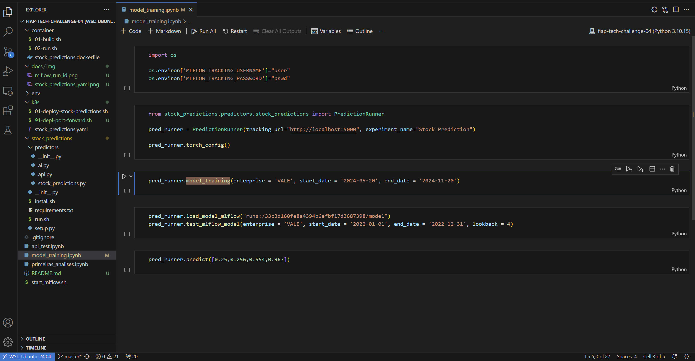
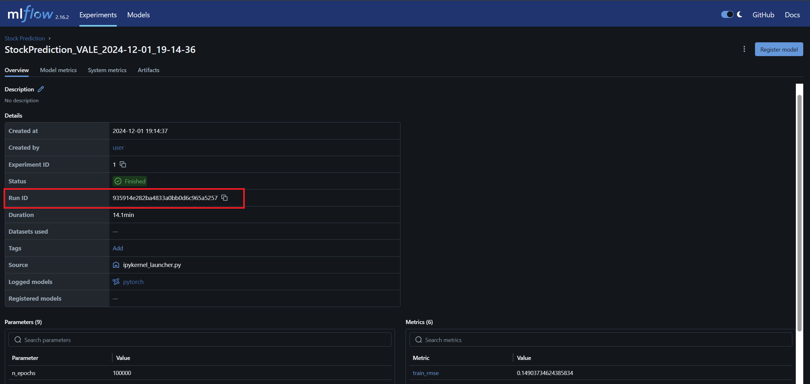
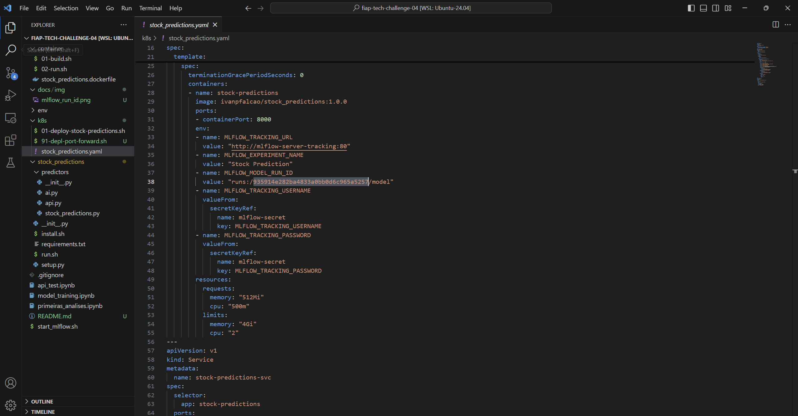
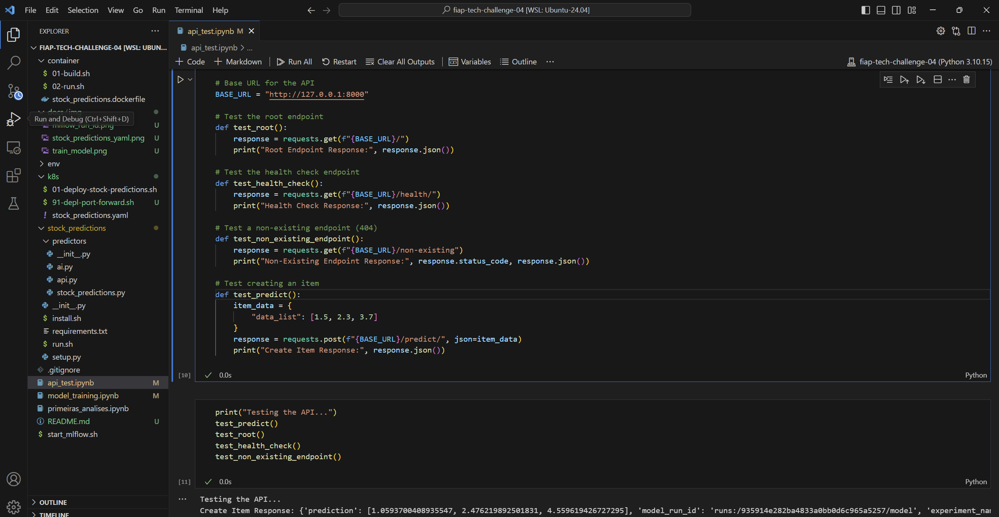

# FIAP Tech Challenge 04

This repository contains the codebase and resources for the FIAP Tech Challenge 04 for the ML Engineering - Pos Tech. The project includes machine learning workflows, API scripts, containerization files, and Kubernetes deployment configurations.

## Project Structure

### Root Directory (`fiap-tech-challenge-04`)
- **`api_test.ipynb`**: Notebook for testing the API endpoints.
- **`model_training.ipynb`**: Notebook for training the stock ML model. Depends on a MLFlow server.
- **`primeiras_analises.ipynb`**: Notebook for initial data analysis.
- **`start_mlflow.sh`**: Script to start the MLflow server locally.

### `container/`
- **`01-build.sh`**: Script to build the Docker image of the API (the current build can be found in [Stock Predictions registry](https://hub.docker.com/r/ivanpfalcao/stock_predictions)).
- **`02-run.sh`**: Script to run the Docker container standalone.
- **`stock_predictions.dockerfile`**: Dockerfile for the stock predictions service.

### `env/`
Environment setup files.

#### `env/mlflow/`
- **`01-deploy-mlflow.sh`**: Script to deploy MLflow in a Kubernetes environment.
- **`90-get-mlflow-pswd.sh`**: Script to retrieve the MLflow password.
- **`91-mlflow-port-forward.sh`**: Script for port-forwarding MLflow Kubernetes services.
- **`values.yaml`**: Helm chart values file for MLflow configuration.

### `k8s/`
Kubernetes deployment files.

- **`01-deploy-stock-predictions.sh`**: Script to deploy the stock predictions service on Kubernetes.
- **`91-mlflow-port-forward.sh`**: Script for MLflow port-forwarding.
- **`stock_predictions.yaml`**: Kubernetes deployment manifest for the stock predictions service.

### `stock_predictions/`
Core logic for the stock predictions service.

- **`install.sh`**: Installation script.
- **`requirements.txt`**: Python dependencies for the project.
- **`run.sh`**: Script to run the application standalone.
- **`setup.py`**: Setup script for the project.

#### `stock_predictions/predictors/`
- **`ai.py`**: Script for AI-related functions.
- **`api.py`**: API implementation.
- **`stock_predictions.py`**: Main script for stock predictions.

## Deployment Steps

### Prerequisites
1. Install [Docker](https://www.docker.com/) and [Kubernetes](https://minikube.sigs.k8s.io/docs/).
2. Install [Helm](https://helm.sh/).
3. Ensure Python is installed for running local scripts.

### Deployment

#### 1. Build and Run Docker Image (Only if the code is changed)
```bash
cd container
sh 01-build.sh
sh 02-run.sh
```

#### 2. Deploy MLflow
```bash
cd env/mlflow
sh 01-deploy-mlflow.sh
# Retrieve MLflow password
sh 90-get-mlflow-pswd.sh
# Port-forward MLflow
sh 91-mlflow-port-forward.sh
```

#### Optional. Train the model


#### Optional. Get MLflow run id


#### Optional. Set the run id on the stock predictions API YAML


#### 3. Deploy Stock predictions
```bash
cd k8s
sh 01-deploy-stock-predictions.sh
# Optional: Port-forward Stock Predictions if required
sh 91-depl-port-forward.sh
```

#### Optional. Test the API

